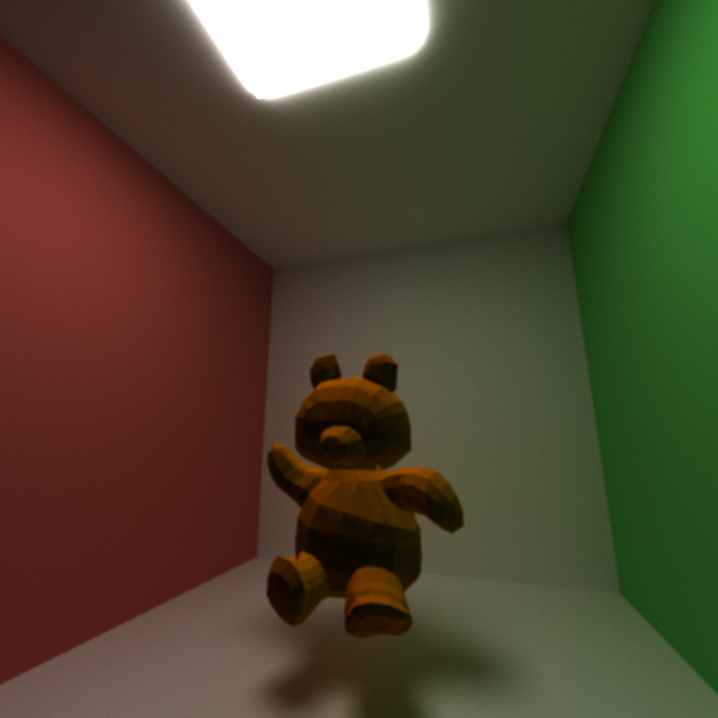

CUDA Path Tracer
================

**University of Pennsylvania, CIS 565: GPU Programming and Architecture, Project 3**

* Joshua Smith
  * [LinkedIn](https://www.linkedin.com/in/joshua-smith-32b165158/)
* Tested on: Ubuntu 20.04, Ryzen 9 3900x @ 4.6GHz, 24GB RTX 4090 (Personal)

----
### README

**Project Description**

In this project, I created a CUDA pathtracer to render 3D scenes. This includes toggleable material sorting. I incorporated some cool features I am especially proud of. Specifically, lottery termination, support for obj meshes, and an Octree based sample for mesh intersections.

In my tests so far, the Octree sampling doubled the frame rate on meshes of about 3k triangles.

Working on more in-depth analysis and readme. This is just the code submission.

**Items Completed**:
  * Standard Impl
  * Octree mesh sampling
  * Obj mesh support
  * Lottery Termination
----

