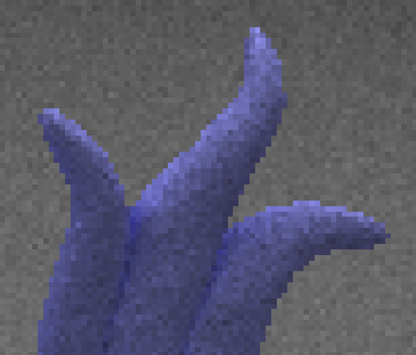

CUDA Path Tracer
================

**University of Pennsylvania, CIS 565: GPU Programming and Architecture, Project 3**

* Joshua Smith
  * [LinkedIn](https://www.linkedin.com/in/joshua-smith-32b165158/)
* Tested on: Ubuntu 20.04, Ryzen 9 3900x @ 4.6GHz, 24GB RTX 4090 (Personal)

----
### README

[XYZ_Dragon.obj Source](https://github.com/alecjacobson/common-3d-test-models/blob/master/data/xyzrgb_dragon.png)

**Project Description**

In this project, I created a CUDA pathtracer to render 3D scenes. This includes toggleable material sorting. I incorporated some cool features I am especially proud of. Specifically, Russian Roulette termination, support for obj meshes, and an Octree based sample for mesh intersections.

**Items Completed**:
  * Standard Implementation
  * BVH mesh sampling
  * Obj mesh support
  * Russian Roulette Termination

----

**Standard Implementation Analysis**

Diffuse and Reflective Material Support:

  * Cosine-weighted random hemisphere sampling for Diffuse Surface [Reference](https://pbr-book.org/4ed/Reflection_Models/Diffuse_Reflection)
  * Mirror-reflection for Reflective Surface

Anti-Aliasing Support

  * Camera rays are uniformly randomly jittered within a range [Reference](https://paulbourke.net/miscellaneous/raytracing/)

No anti-aliasing vs with anti-aliasing  

 

Stream-Compaction For Ray Termination:

  * After every ray is traced forward to determine collision/reflection, rays with no valid collision are removed from the raytracing process with stream-compaction. Additionally, rays that collide with a light object are terminated and have the resulting color applied to the image.
  * For environments with open-ends, like the cornell box, this greatly reduces the number of paths that need traced per iteration.
  * Ex. Number of ray objects per reflection timestep for a closed vs open environment. Tested on Dragon-Museum scene with a closed and open back wall:

 

  * Evidently, Stream-Compaction on ray objects reduces the amount of rays that need to be traced per timestep. This allows faster runtime for later iterations as fewer ray intersections need to be traced after each timestep. Light objects also terminate rays, so even closed environment benefit from compaction.

Material Sorting:

  * Different types of materials have intersections handled differently.
  * If adjacent material intersection have different material types, warp divergence can occur during ray-bounce calculation (as this depends on material type)
  * However, I generally found that material sorting slowed overall runtime. As an example, in the following scene, material sorting yielded an average fps of 13.1, whereas foregoing material sort averaged 14.8fps. This is likely due to the sorting overhead being more costly than the warp divergence. 

   

  * For the specular (mirror reflection) Cornell Box, sorting by material halved runtime from about 50 to 25 fps. 

----

**Advanced Feature Analysis**

**Russian Roulette Sampling:**

* Russian Roulette Termination is implemented with linear falloff
* Given a falloff threshold x, the probability of a rays termination is:
$p = \frac{x - ||\text{color}||}{x}$. 
* If a ray is terminated, its color is set to 0. If a ray is not terminated, its color is multiplied by $\frac{1}{1-p}$. This yields the same expectancy of pixel color while reducing the number ray bounces needed for a given pixel sampling iteration on average. However, it will increase sampling variance an may require more iterations to yield a stable pixel color.

   

* Here is two example images showing standard termination vs extreme Russian-Roulette Termination (threshold=8.0) for only 400 iterations to show the variance difference.

 

* For smaller thresholds, there is an appreciable speedup without major qualitative difference. Ex. (threshold=0.6):

 

**Arbitrary Mesh Loading (obj):**
  * Implemented support for obj object models
  * These are read in with a custom obj file reader. Non-triangular faces are converted to sets of triangles.
  * For simplicity, each triangle is stored as a self-contained struct with vertex information. This is relatively memory-inefficient but allows for a simpler implementation for intersection check and avoids the extra index->vertex memory lookup relative to face/vertex seperate storage methods.
  * Supports both diffuse and reflective surfaces ex:

   
  

  * In this implementation, the face normal is taken directly as the reflection normal. A possible improvement would be calculating smooth reflection. Even with finite normals, the bary-centric coordinates from triangle intersection can be used to interpolate over vertex or neighbor-face normals yielding smooth reflection. The reflective surface roughness can be seen in the purple dragon render, as the reflective spots often correspond with single triangles. This results in the "glittery" appearance which is slightly inaccurate, albeit I think it looks pretty cool.
  * Anti-aliasing, however, which is present in this implementation, helps with reflection smoothness  

**Bounding Volume Heirarchy**

Creation:
  * A bounding volume heirarchy is implemented to reduce triangle-intersection lookup time. 
  * Given a set of triangles, a bounding axis-aligned box is produced by finding the min/max along each axis for all vertices with thrust.
  * This set of vertices is then sorted (thrust) and split in half along the x, y, then z axes. Then the process of determining bounding volume and further splitting is done recursively. 
  * This splitting method ensures the number of triangles within bounding-boxes on the same depth are the same (off-by-one possible). However, volumes of bounding boxes may become off-balanced as depicted below. 
  * This process repeats creating a balanced tree with node-degree 8. A defined approximate leaf size (num triangles in a terminal bounding-box) determines the depth of the tree. 
  * These bounding volumes and sorted leafs are stored linearly in GPU memory

Testing Intersection:
  * Given a ray, intersection is tested for the overall bounding box. If there could possibly be a min-distance intersection, then the children of that bounding box are further tested in an iterative fashion on the GPU. 
  * Once a terminal bounding box is reached, all of the triangles within the node are tested linearly for the min-distance intersection. 
  * Terminal leaf size of 1 triangle is suboptimal. Due to BVH overhead, it generally is faster to linearly test the last 10-80 triangles.

Scenes Evaluated: Teddy(3192 triangles), Dragon(249992 triangles)
Scenes:

 

Linear vs BVH Tree Depth Runtime Graphs:

(Zero depth is a single bounding volume)

 

In both tests, the optimal runtime is achieved with the approximate leaf size parameter set to 10. For Teddy this yields 28 fps and for the dragon this yields 5.2fps. Interestingly, further decomposition into smaller BVHs leads to worse runtime.

Visualizing terminal bbox sizes for incremental BVH Depths for Teddy. We can see they get progressively smaller. However, they overlap due to the triangles, which are grouped by midpoint, having a min/max span.

 

 

----

Obj Credit:
All objs were obtained [here.](https://github.com/alecjacobson/common-3d-test-models/tree/master)